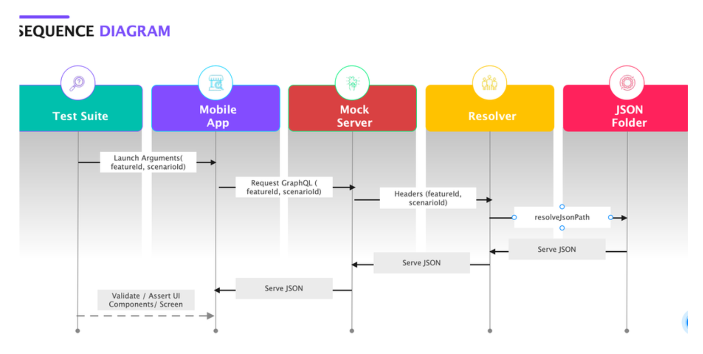

# mockServer

MockServer to serve rest and graphql queries for mobile app automation testing

- Clone the repository: git clone https://github.com/mushtaque87/mockServer
- Install the dependencies: npm install or yarn install
- Start the server: npm mockserver or yarn mockserver

The server is an Node/Express HTTP server with graphql serving capabilities. The server reads the schema.graphql type defination and the resolver resolves the queries and read the json files and serves back the response.

## Steps

1. The test suite launch the the mock app with launch arguments ( featureId and scenarioId).
2. The useAmplify hooks makes graphql request and rest endpoint request from localhost mock server ( http://localhost:3000).
3. The mockserver listens to the request made and pass the request to resolver with proper headers.
4. The resolver reads the info( featureId and scenarioId) from headers and resolves the jsonPath from which the json response should be
   served.
5. The resolver reads the json from the correct .json file from the json folder with folder name equal to featureId and returns back the
   json response to the application.
6. The test suites then validates/asserts the application screen.

# Sequence Diagram

